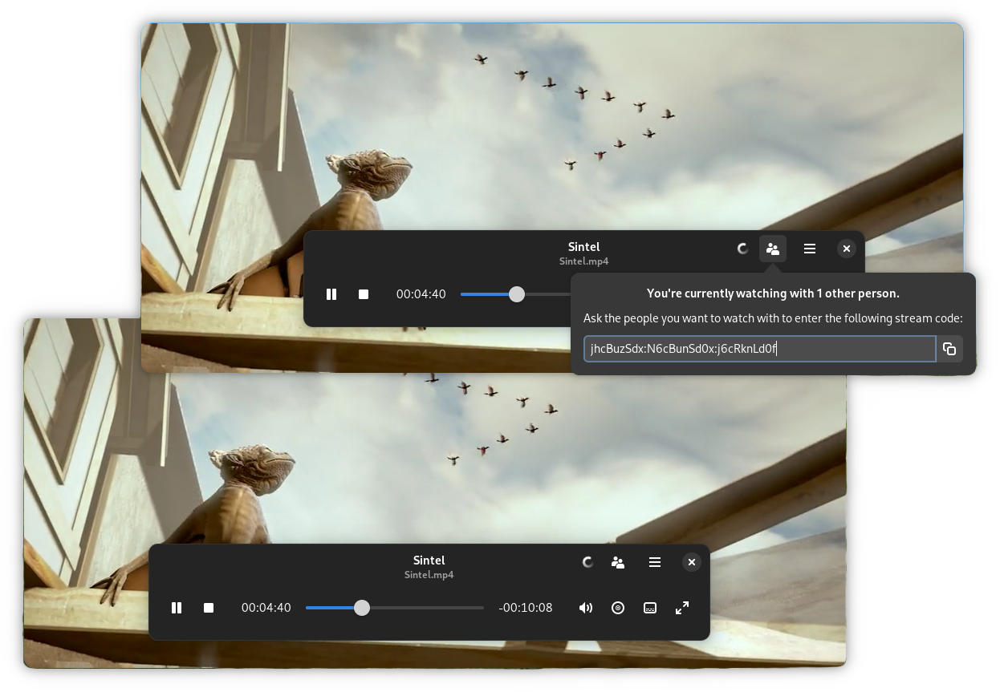
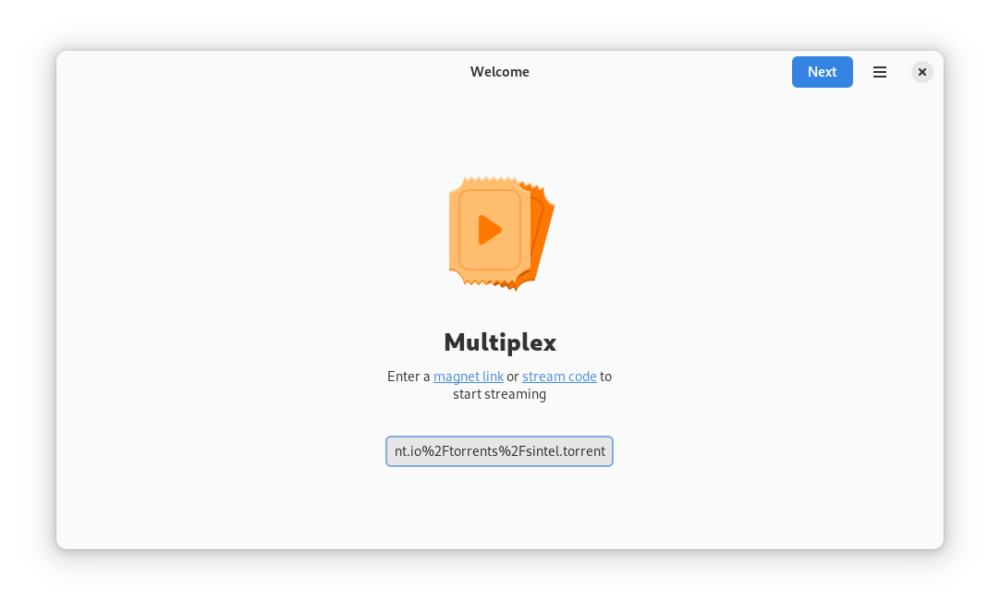
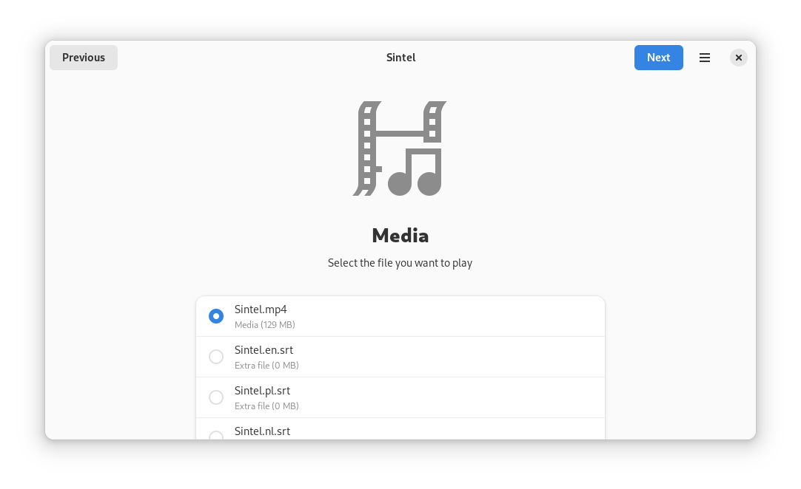
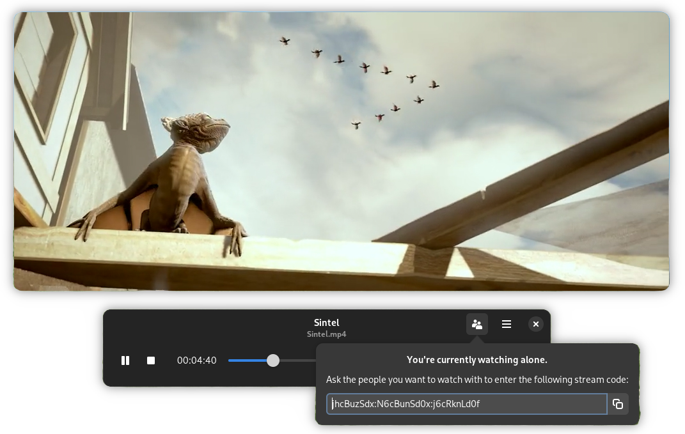
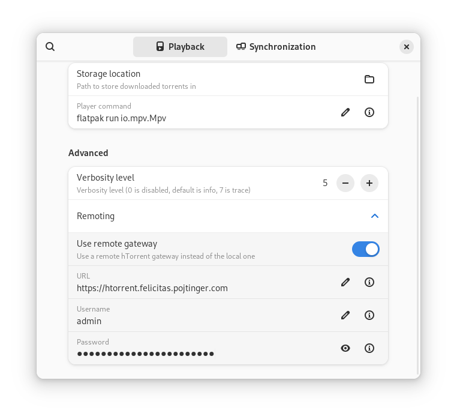

# Multiplex

Watch torrents with your friends.

<br/>

<p align="center">
  
</p>

[](https://github.com/pojntfx/multiplex/actions/workflows/flatpak.yaml)

[](https://pkg.go.dev/github.com/pojntfx/multiplex)
[](https://matrix.to/#/#multiplex:matrix.org?via=matrix.org)

## Overview

Multiplex is an app to watch torrents together, providing an experience similar to Apple's [SharePlay](https://support.apple.com/en-us/HT212823) and Amazon's [Prime Video Watch Party](https://www.amazon.com/adlp/watchparty).

It enables you to:

- **Stream any file directly** using a wide range of video and audio formats with the mpv video player
- **Host online watch parties while preserving your privacy** by synchronizing video playback with friends without a central server using [weron](https://github.com/pojntfx/weron)
- **Bypass internet restrictions** by optionally separating the [hTorrent HTTP to BitTorrent gateway](https://github.com/pojntfx/htorrent) and user interface into two separate components

## Installation

On Linux, Multiplex is available on Flathub:

<a href="https://flathub.org/apps/details/com.pojtinger.felicitas.Multiplex"></a>

For other platforms, see [contributing](#contributing); development builds are also available on [GitHub releases](https://github.com/pojntfx/multiplex/releases/tag/release-main).

## Tutorial

### 1. Start Streaming a Torrent

To get started, first find a [magnet link](https://en.wikipedia.org/wiki/Magnet_URI_scheme) that you want to stream. There are many sites on the internet to find them; check out [webtorrent.io/free-torrents](https://webtorrent.io/free-torrents) for some copyright-free torrents to try out. Once you've found one, launch Multiplex and enter the link:

<p align="center">
  
</p>



Note that Multiplex will prompt you to install the [mpv media player](https://mpv.io/) if you don't already have it installed; to continue, please do so:

<p align="center">
  
</p>

Next, select the file you want to stream; note that only media files are supported:



Finally, confirm that you have the right to stream the media you've selected. Note that many countries have copyright restrictions - in that case, please [take appropriate measures to protect yourself](https://sec.eff.org/topics/VPN):


Note that you can also choose to stream without downloading! Provided that the underlying media file supports streaming playback (such as `.mkv` files), this allows you to start playing the media immediately, without having to wait for it to download completely:

<p align="center">
  
</p>

After you've given your consent, playback will start, and you can enjoy the media you've selected:


## 2. Ask Friends to Join

While consuming media on your own can be fun, doing so with friends or your SO is always better. I built Multiplex to enjoy media together with my partner, but due to COVID and the Atlantic ocean we're unable to do so in person all the time - this app intents to bridge that gap. To ask someone to join, click on the people button in the top right, and copy the [stream code](https://github.com/pojntfx/multiplex/wiki/Stream-Codes):



This stream code can now be entered by the person that wants to watch the media with you. There is no technical limit on how many people can join the session, so feel free to invite as many as you want!


After the person that wants to join has entered the stream code, they need to confirm that they too have the right to stream the media; depending on your country, please ask them to [take appropriate measures to protect themselves](https://sec.eff.org/topics/VPN):


Note that is recommended not to choose the option to stream without downloading when streaming with multiple people; while it is supported and buffering is synchronized across peers, it requires a very good internet connection for all peers in order for it to work smoothly. Once all peers have joined, you can start playback and enjoy the media together:


All play/pause events, seeking position etc. will be synchronized between all peers using [weron](https://github.com/pojntfx/weron), a peer-to-peer networking library.

## 3. Increase Privacy and Security

As noted above, the legality of consuming media from torrents depends on the country you're in. In most countries, following [these guidelines on VPNs from the Electronic Frontier Foundation](https://sec.eff.org/topics/VPN) will suffice, but Multiplex provides an additional option: **Remoting**.

Multiplex is built on [hTorrent](https://github.com/pojntfx/htorrent), an HTTP to BitTorrent gateway. Using remoting, it is possible to use a trusted server as a proxy to stream torrents from. This makes it possible to not only increase security for all peers without them having to take the appropriate measures themselves, but it can also increase the performance by caching the media on a single server with a good internet connection. To enable remoting, first [host a hTorrent gateway with basic authentication enabled](https://github.com/pojntfx/htorrent#1-start-a-gateway-with-htorrent-gateway) - be sure to set up TLS certificates to enable encryption, for example by using [Caddy](https://caddyserver.com/). Once you have a gateway set up, you can configure Multiplex to use in its preferences:



Be sure to ask the people who want to stream the media with you to also use the gateway.

For more preferences, see the [screenshots](#screenshots).

🚀 **That's it!** We hope you enjoy using Multiplex.

## Screenshots

Click on an image to see a larger version.

<a display="inline" href="./docs/screenshot-initial.png?raw=true">

</a>

<a display="inline" href="./docs/screenshot-media-selection.png?raw=true">

</a>

<a display="inline" href="./docs/screenshot-confirmation.png?raw=true">

</a>

<a display="inline" href="./docs/screenshot-playback.png?raw=true">

</a>

<a display="inline" href="./docs/screenshot-audiotracks.png?raw=true">

</a>

<a display="inline" href="./docs/screenshot-subtitles.png?raw=true">

</a>

<a display="inline" href="./docs/screenshot-join.png?raw=true">

</a>

<a display="inline" href="./docs/screenshot-sync-playback.png?raw=true">

</a>

<a display="inline" href="./docs/screenshot-prefs-playback.png?raw=true">

</a>

<a display="inline" href="./docs/screenshot-prefs-remoting.png?raw=true">

</a>

<a display="inline" href="./docs/screenshot-prefs-sync.png?raw=true">

</a>

## Acknowledgements

- [Brage Fuglseth](https://bragefuglseth.dev/) contributed the icon.
- [mpv](https://mpv.io/) provides the media player.
- [diamondburned/gotk4](https://github.com/diamondburned/gotk4) provides the GTK4 bindings for Go.
- [diamondburned/gotk4-adwaita](https://github.com/diamondburned/gotk4-adwaita) provides the `libadwaita` bindings for Go.
- [hTorrent](https://github.com/pojntfx/htorrent) provides the torrent gateway.
- [weron](https://github.com/pojntfx/weron) provides the WebRTC library for playback synchronization.

## Contributing

To contribute, please use the [GitHub flow](https://guides.github.com/introduction/flow/) and follow our [Code of Conduct](./CODE_OF_CONDUCT.md).

To build and start a development version of Multiplex locally, run the following:

```shell
$ git clone https://github.com/pojntfx/multiplex.git
$ cd multiplex
$ go generate ./... # Also see https://github.com/dennwc/flatpak-go-mod for updating the Flatpak manifest with Go dependencies and https://gist.github.com/pojntfx/6733a6aaff22d3dd0d91eefde399da42 for updating the icons
$ go run .
```

You can also open the project in [GNOME Builder](https://flathub.org/apps/org.gnome.Builder) and run it by clicking the play button in the header bar.

## License

Multiplex (c) 2024 Felicitas Pojtinger and contributors

SPDX-License-Identifier: AGPL-3.0
